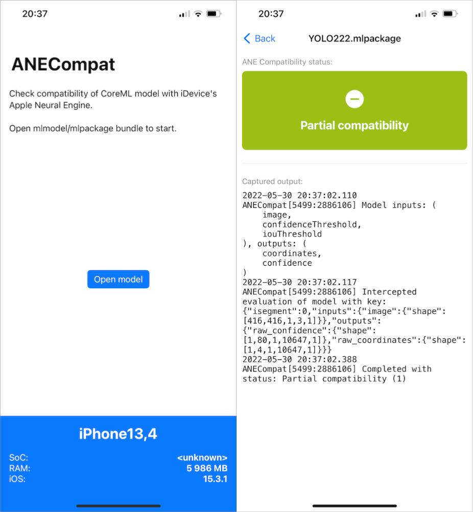

# ANECompat

A tool to check compatibility of CoreML model with Apple Neural Engine (and if it runs end-to-end or only specific segments). Useful during the process of designing/choosing neural network architecture.

Note that this tool check compatibility against neural engine of the host and each generation of Apple SoC's have different ANE with varying feature sets and performance. Checkout this [document](https://github.com/hollance/neural-engine/blob/master/docs/supported-devices.md) to see which chips have ANE.

Command-line tool is compatible with Apple Silicon macs. iOS app is also available - see [iOS Version](#ios-version).

## How does it work?

`ANECompat` works by swizzling inference methods in `AppleNeuralEngine` private framework, which is used internally by CoreML (Espresso to be more specific).

CoreML runtime partitions neural network computation graph based on operations and complexity with focus on performance. Segments of a model with operations which are not supported by the neural engine will be assigned to be run on other compute unit. Switching between compute units can be expensive, that's why tuning a model to be fully ane-friendly is one of ways to maximize performance.  

## Install

Program can be installed via [Homebrew](https://brew.sh/):
```sh
brew tap fredyshox/tools
brew install anecompat
```

Optional python bindings can be installed by downloading repository sources and running [setup.py](./setup.py) script:
```sh
# if anecompat was installed via homebrew, use python3 distribution from there too
python3 setup.py install 
```

## Usage

Tool supports models with multiple inputs or outputs. Supported feature types for input: multi-array, image, int64, float, string. Program returns following compatiblity statuses:

* Fully compatible (0) - model forward pass is running end-to-end on ANE
* Partial compatibility (1) - some segments of the model are running on ANE 
* * hint about these segments is present in program output (model key JSON)
* * program currently does not extract specific information about segments, but these can be identified by looking for identifiers from `inputs`/`outputs` of model key in mlmodel [MIL](https://coremltools.readme.io/docs/model-intermediate-language) representation. See [Model key JSON](#command-line-tool) below.
* Not compatible (2) - model is not running on ANE at all

### Python API

[anecompat.py](./python/anecompat.py) contains Python bindings which is single function:

```python
def test_ane_compatibility_coreml_model(mlmodel_or_path)
```

**Parameters**

`mlmodel_or_path: str | coremltools.models.MLModel` 
* Instance of MLModel from coremltools, or path to mlmodel/mlpackage or compiled mlmodelc bundle

**Returns**

`status: int`
* integer status: 0 - fully compatible, 1 - partially compatible, 2 - not compatible

### Command-line tool

MLModel can be evaluated from command-line using `anecompat` tool on macs with neural engine (AppleSilicon macs).

```
anecompat MODELPATH [LOGDIR]
```

`MODELPATH` path to `mlmodel`/`mlpackage` or compiled `mlmodelc` file

`LOGDIR` optional path to directory where additional logs and file dumps will be stored

Example output:
```
$ anecompat path/to/superresolution.mlpackage

Model inputs: (
    "input_1"
), outputs: (
    Identity
)
Intercepted evaluation of model with key: {"isegment":0,"inputs":{"input_1":{"shape":[12,1280,1,720,1]}},"outputs":{"Identity":{"shape":[3,1280,1,720,1]}}}
Completed with status: Fully compatible (0)
```

**Model key JSON**

Model key is JSON structure identifing model segment loaded into ANE. When anecompat intercepts prediction it prints model key as seen on the example output above. It contains following:

* `isegment` - index of a segment
* `inputs` - model inputs where key is input identifier and value contains properties like shape
* `outputs` - model outputs in similar fashion as `inputs`

Identifiers of inputs and outputs are directly related with MLModel input/output names and tensor declarations from [MIL](https://coremltools.readme.io/docs/model-intermediate-language) (at least thats how it works on [mlprogram](https://coremltools.readme.io/docs/ml-programs) models). [MIL](https://coremltools.readme.io/docs/model-intermediate-language) representation of `mlprogram` models, can be found in `model.mil` file stored inside compiled .mlmodelc bundle.

**Examples**

Analysis of popular models from [Apple](https://developer.apple.com/machine-learning/models/), which would all receive "Partially compatible (1)" status.

* MNIST classifier. Inputs `image`: Image. Outputs `labelProbabilities`: [Int -> Double], `classLabel`: Int
```json
{ 
    "isegment": 0,
    "inputs": { 
        "image": { "shape": [28,28,1,1,1] } 
    },
    "outputs": { 
        "labelProbabilities": {"shape":[1,1,1,10,1] }
    } 
}
```
Based on model key, assumption can be made that model is running almost exclusively on ANE, except for conversion between `labelProbabilities` and `classLabel` happening at the end of forward pass.

* YOLOv3 float16. Inputs `image`: Image, `confidenceThreshold`: Double, `iouThreshold`: Double. Outputs `coordinates`: MultiArray, `confidence`: MultiArray
```json
{
    "isegment": 0,
    "inputs": {
        "image": { "shape": [416,416,1,3,1] } 
    },
    "outputs": { 
        "raw_confidence": { "shape": [1,80,1,10647,1] },
        "raw_coordinates": { "shape": [1,4,1,10647,1] }
    }
}
```

* DeepLabV3 float16. Inputs `image`: Image. Outputs: `semanticPredictions`: MultiArray
```json
{
    "isegment": 0,
    "inputs": {
        "image": { "shape": [513,513,1,3,1] }
    },
    "outputs": { 
        "logits\/semantic\/BiasAdd:0": { "shape":[65,65,1,21,1] }
    }
}
```
## Build

### Requirements:
* Apple Silicon mac
* Xcode command-line tools
* macOS 12 Monterey (previous not tested)

### Building from source

Clone repository, then from project directory execute:

```
make
```

`build/` directory will be created with artifacts: `anecompat` executable and `libANECompat.dylib` shared library.

To install compiled artifacts execute:

```
make install 
```

## iOS Version

iOS port of this tool is also available in [ios/](./ios) subdirectory. Simple app can open mlmodel/mlpackage bundles and perform evaluation against ANE of host device. It shows model compatibility status and same textual output as command-line equivalent.



App can only be run on `arm64e` devices (iPhone XS/XR and newer). Latest IPA for sideloading is available in [Github Release](https://github.com/fredyshox/ANECompat/releases/latest).